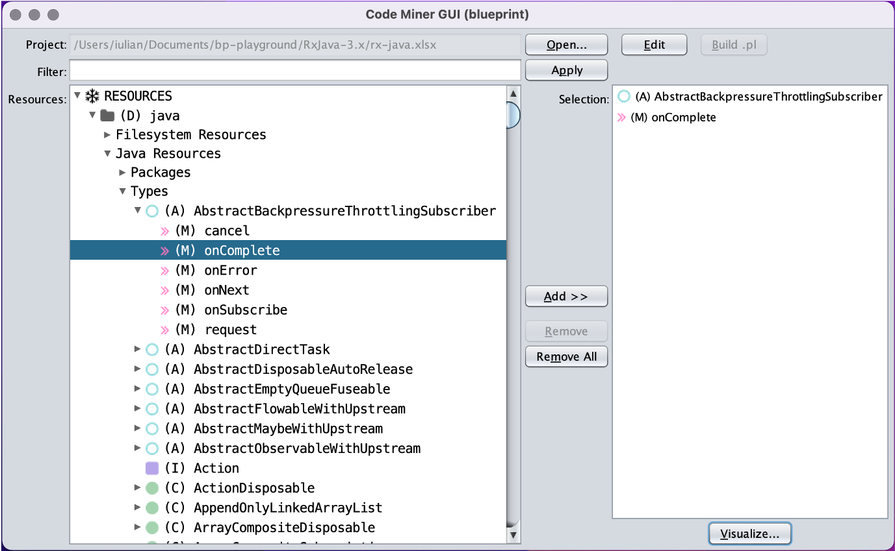
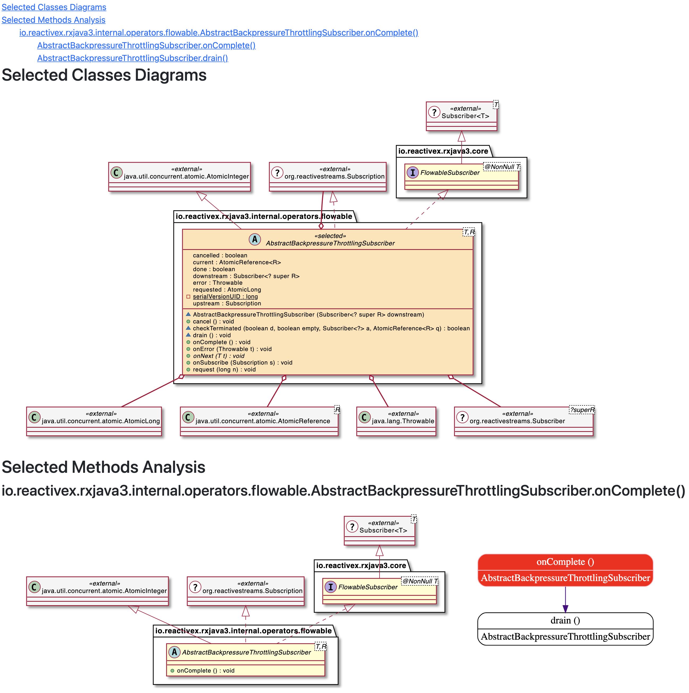

## execdoc-apps

UI components for building [execdoc-core](https://github.com/codingspeedup/execdoc-core) based utilities.

Here is a PoC application demonstrating how a Java project source folder can be explored and visualized.

It is intended to ease the understanding of a large project code base for the newcomers.

After selecting a (group of) folders, the resources tree in the screenshot is
gradually build and cached in response to user actions.

Choosing the various items to appear in the detailed mining report can be managed using a
"shopping basket" model.

Once the [Visualize...] button is clicked the project folders are mined again and,
depending on the types of selected items, the appropriate UML diagrams are compiled in a report.

The entire report is actually a static website that allows navigation and visualization
of the original resource files.

The diagrams are generated using [PlantUML](https://plantuml.com/).
