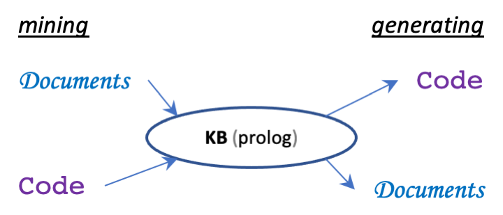

## execdoc-core

This library provides core functionalities for developing various automation utilities
that can mine and generate both executable code and office documents.

The idea came from the painful realization that managing all the pieces of information
pertaining to a software development project is a laborious, time-consuming task and that
overlooked details can have a significant impact on the project cost and schedule.

The objective here is to build and maintain a "single source of truth" knowledge base that
can be intuitively or even transparently used both by humans and computers in collaboration.
Such a knowledge base can be used for querying and reasoning about the project data and can
be updated automatically.

At some point the realization occurred that a Prolog program can serve as a solution for
storing and processing project related information.
The amount of data can be large, but we are not talking about big data.
On the other hand dealing directly with Prolog on a daily basis is not something that a
business analyst or a regular developer is willing to do.

 

 

The main functionalities implemented here are concerned with mining various types of
input sources and mapping the gathered result to Prolog facts and rules.
At the core, a taxonomy based on the
OMG [Knowledge Discovery Model](https://en.wikipedia.org/wiki/Knowledge_Discovery_Metamodel)
is used.
The conceptual hierarchy can be easily extended according to the necessities of the project.

Here is an overview of the supported workflows:

For now minimal mining functionalities are implemented for:
- Filesystem
- Textual log files
- Java files (via [JavaParser](https://javaparser.org/))
- Excel files (via [Apache POI](https://poi.apache.org/))
- SQL schemas (via JDBC)

For generation are provided:
- Diff reports for files & folders
- A basic code mining desktop application [execdoc-apps](../execdoc-apps/README.md)
- A PoC for generating end-to-end enterprise applications via JDL [execdoc-jhipster](../execdoc-jhipster)